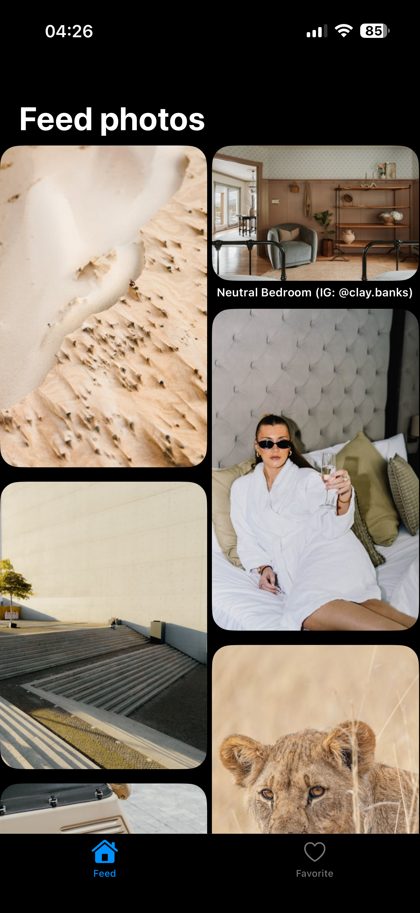
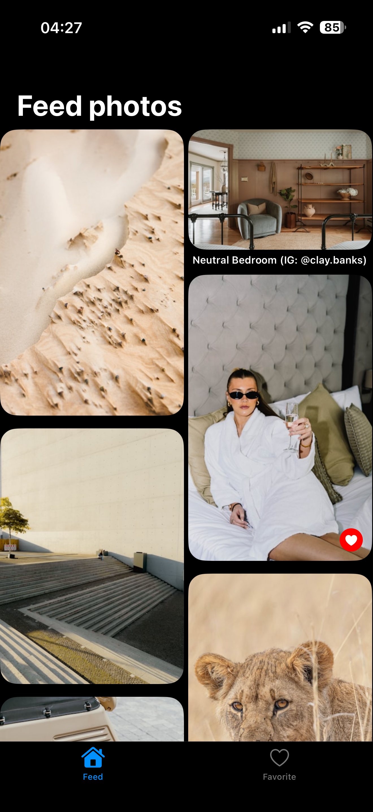
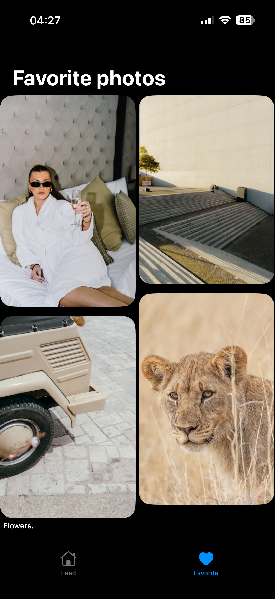

# Gallery App

An iOS application for browsing and managing photos from the Unsplash API. The app is built using **Swift** with **UIKit** and supports **iOS 15 and later**.  
It follows **MVVM + Coordinator** with a **Clean Architecture** approach and demonstrates separation of concerns, modularity, and scalable code structure.

---

## Project Overview

The application consists of two main screens accessible via a Tab Bar:
- **Feed Photos:** Displays images fetched from the Unsplash API with pagination.
- **Favorite Images:** Displays the list of images saved locally as favorites.

The app supports browsing photos, viewing detailed information, adding images to favorites, and navigating between them with gestures.

## Demo video

## Architecture

The project follows **MVVM + Coordinator** and is organized into three layers:

- **Data layer:** Responsible for data sources, repositories implementations and interaction with network and local storage.
- **Domain layer:** Contains business logic and use cases.
- **Presentation layer:** Contains view models, view controllers and coordinators.

Key points:
- **MVVM:** Moves logic out of view controllers into view models. View models notify view controllers of changes using callbacks.
- **Coordinator:** Handles navigation flow, removing navigation logic from view controllers.
- **Dependency Injection:** Implemented using **Swinject** to decouple components and improve testability.

---

## Technologies and Frameworks

- **Language:** Swift
- **Minimum iOS version:** 15.0
- **UI Framework:** UIKit
- **Architecture:** MVVM + Coordinator, Clean Architecture
- **Networking:** URLSession
- **Image Caching:** NSCache
- **Local Storage:** CoreData
- **Dependency Injection:** [Swinject](https://github.com/Swinject/Swinject)
- **Layout:** [CHTCollectionViewWaterfallLayout](https://github.com/chiahsien/CHTCollectionViewWaterfallLayout) for displaying photos in a waterfall layout
- **Code formatting:** [SwiftLint](https://github.com/realm/SwiftLint) with a custom `.swiftlint.yml` configuration file integrated into **Build Phases**

---

## Features

### Feed Photos Screen
- Displays a collection of images fetched from the Unsplash API using the **List Photos** endpoint.
- Loads photos in pages of 30 items each. Additional pages are fetched and appended as the user scrolls to the bottom (pagination).
- Each cell initially shows a view filled with the image’s average color as a placeholder while the preview image loads.
- Tapping on an image opens the **Image Detail** screen.
- Added to favorites photos are displayed with a visual indicator in form of a heart symbol.

#### Screenshots

|  |  |
|-------------|---------------|
| Regular Feed Photos screen | Feed Photos with saved image |

---
### Image Detail Screen
- Shows the selected image in high resolution.
- Displays author name and image description.
- Supports swipe gestures to navigate between images.
- Allows adding or removing an image from favorites by tapping a heart-shaped button.

#### Screenshots

|  |  |
|-------------|---------------|
| Details screen | Details screen of a saved image |

---
### Favorite Images Screen
- Displays a collection of images saved to favorites.
- Images are stored locally using **CoreData**.
- Tapping on an image opens the **Image Detail** screen, where users can remove it from favorites.
- Unlike the feed screen, the favorites collection does not show a heart indicator.

#### Screenshots

|  |  |
|-------------|---------------|
| Favorite Photos screen | Favorite Photos screen with no saved images |

---

## Data Persistence and Networking
- Favorite images are stored locally using **CoreData** to ensure persistence across app launches.
- Network requests are made asynchronously using **URLSession**.
- Images are cached in memory using **NSCache** for improved performance.
- Both network and local data operations include error handling.

---

## Configuration

- The project includes **SwiftLint** for code style checks, triggered via a build script in Xcode’s **Build Phases**.
- A `.swiftlint.yml` configuration file defines the code style rules.
- If SwiftLint is not installed locally, remove or disable the SwiftLint build script in **Build Phases** to compile the project without linting.
- The Unsplash API key is already included in the project for testing purposes. No additional configuration or environment file is required.

---

